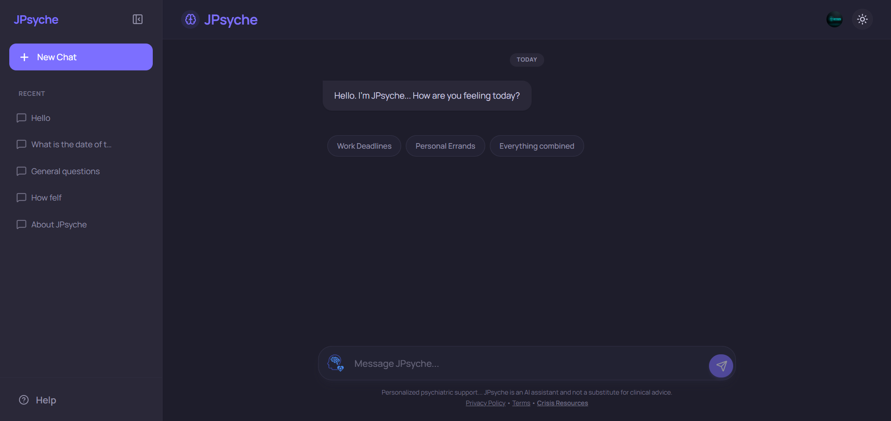

<div align="center">


# JPsyche

**Your personal virtual psychiatrist — available anytime, anywhere.**

A full-stack AI mental wellness chat application built with Next.js, Clerk authentication, and a conversational AI backend. JPsyche provides a warm, structured space for users to talk through stress, anxiety, and everyday overwhelm.

[](https://nextjs.org)
[](https://www.typescriptlang.org)
[](https://tailwindcss.com)
[](https://clerk.com)
[](LICENSE)
[](https://jpsyche.vercel.app)



</div>

---

## ✨ Features

### 🧠 AI-Powered Conversations
- Real-time chat with a psychiatrist-style AI assistant
- Intelligent **thought transparency** — the AI can surface its internal reasoning via `[Thought: ...]` blocks shown in a distinct callout above the response
- Streaming-ready API route with graceful error recovery and user-friendly fallback messages

### 🗣️ Text-to-Speech (TTS)
- Read-aloud any assistant message with a single tap
- **Automatic language detection** — detects Hindi (Devanagari script) vs. English and selects the best available voice accordingly
- Voice quality prioritisation: Neural → Google → Language-matched → System default
- Stop playback at any time; markdown symbols are stripped before speaking for natural delivery

### 💬 Full Chat Management
- **New Chat** — starts a fresh session instantly
- **Recent chats sidebar** — lists all past conversations, sorted by most recently updated
- **Rename** and **Delete** chats inline
- **Auto-titling** — new chats are titled from the first 30 characters of the user's opening message
- Optimistic UI updates for snappy sidebar interactions, with SWR revalidation to keep state in sync

### ✏️ Message Editing
- Edit any sent message mid-conversation — the thread forks at that point, discarding subsequent messages and re-submitting with the corrected text
- Full keyboard support: `Enter` to save & submit, `Escape` to cancel

### 📋 Copy to Clipboard
- One-click copy on both user and assistant messages
- Visual confirmation tick that resets after 2 seconds

### 🔒 Authentication & Guest Mode
- Powered by **Clerk** — modal sign-in/sign-up flows, no page redirects
- Guest users get **3 free trial messages** before being prompted to create an account
- Authenticated users get full persistent chat history synced to the database

### 🌗 Light / Dark Mode
- System preference respected by default via `next-themes`
- Manual toggle in the header
- Smooth 400ms colour transitions across the entire UI

### 📱 Responsive & Mobile-First
- Full mobile layout with a collapsible sidebar
- Sidebar auto-closes on mobile after selecting or creating a chat
- Safe-area inset handling (`env(safe-area-inset-*)`) for notch and home-bar devices
- `100dvh` layout that correctly accounts for mobile browser chrome

### ♿ Accessibility
- ARIA labels on icon-only buttons
- Focus rings on interactive elements
- Keyboard-navigable chat input (`Enter` to send, `Shift+Enter` for newlines)

---

## 🛠️ Tech Stack

| Layer | Technology |
|---|---|
| Framework | [Next.js 16](https://nextjs.org) (App Router) |
| Language | TypeScript |
| Styling | Tailwind CSS v4 with CSS custom properties |
| Font | [Manrope](https://fonts.google.com/specimen/Manrope) (Google Fonts) |
| Auth | [Clerk](https://clerk.com) |
| Data Fetching | [SWR](https://swr.vercel.app) |
| Animation | [Framer Motion](https://www.framer.com/motion/) |
| Markdown | [react-markdown](https://github.com/remarkjs/react-markdown) |
| Icons | [Lucide React](https://lucide.dev) |
| TTS | Web Speech API (browser-native) |

---

## 🚀 Getting Started

### Prerequisites

- Node.js 18+
- A [Clerk](https://clerk.com) account (free tier works)
- An AI API key for the backend chat route (e.g. OpenAI, Anthropic, etc.)

### Installation

```bash
# 1. Clone the repository
git clone https://github.com/jeetu-programmer7887/JPsyche.git
cd JPsyche

# 2. Install dependencies
npm install

# 3. Set up environment variables
cp .env.example .env.local
```

### Environment Variables

Create a `.env.local` file in the project root:

```env
# Clerk Authentication
NEXT_PUBLIC_CLERK_PUBLISHABLE_KEY=pk_...
CLERK_SECRET_KEY=sk_...

# Clerk Redirect URLs
NEXT_PUBLIC_CLERK_SIGN_IN_URL=/sign-in
NEXT_PUBLIC_CLERK_SIGN_UP_URL=/sign-up

# AI Backend (add your provider key here)
AI_API_KEY=your_api_key_here
```

### Running Locally

```bash
npm run dev
```

Open [http://localhost:3000](http://localhost:3000) in your browser.

---

## 📁 Project Structure

```
JPsyche/
├── app/
│   ├── layout.tsx          # Root layout — Clerk + ThemeProvider
│   ├── globals.css         # Design tokens (CSS custom properties), Tailwind v4
│   └── page.tsx            # Main chat page — all chat logic lives here
├── components/
│   ├── sidebar.tsx         # Collapsible sidebar with chat list
│   └── theme-toggle.tsx    # Light/dark mode toggle button
├── api/
│   ├── chat/route.ts       # AI chat endpoint
│   └── chats/route.ts      # CRUD for chat session persistence
└── public/
    ├── brain.png           # App icon
    └── mental-health.png   # Chat input icon
```

---

## 🎨 Design System

JPsyche uses a semantic CSS custom property system with full dark mode support:

```css
/* Light */
--background: #faf8ff;
--primary: #004ac6;
--surface: #faf8ff;
--on-surface: #191b23;

/* Dark */
--background: #1e1d2b;
--primary: #7c6fff;
--surface: #232233;
```

All colours are exposed as Tailwind utilities via `@theme`, enabling classes like `bg-primary`, `text-on-surface`, `border-outline-variant`, etc.

---

## ⚠️ Disclaimer

> JPsyche is an AI assistant designed for general emotional support and wellness conversations. **It is not a substitute for professional clinical advice, diagnosis, or treatment.** If you are experiencing a mental health crisis, please contact a qualified healthcare professional or visit our [Crisis Resources](/crisis) page.

---

## 📄 License

This project is licensed under the [MIT License](LICENSE).

---

<div align="center">

Built with care by **Jeetu** · [Privacy Policy](/privacy) · [Terms](/terms) · [Crisis Resources](/crisis)

</div>
